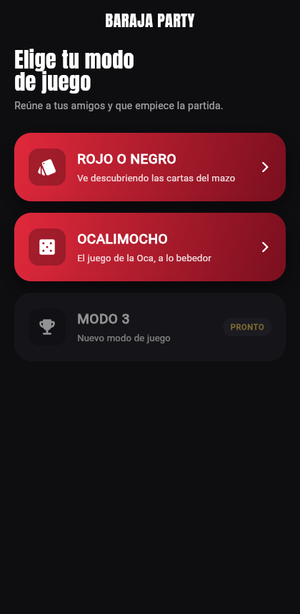
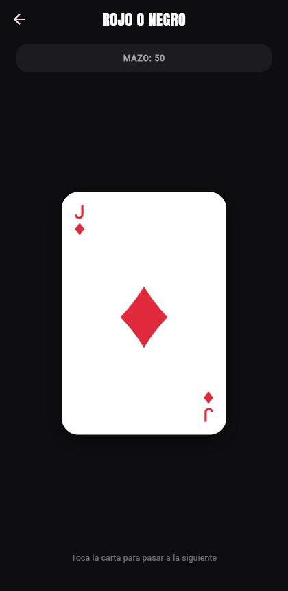
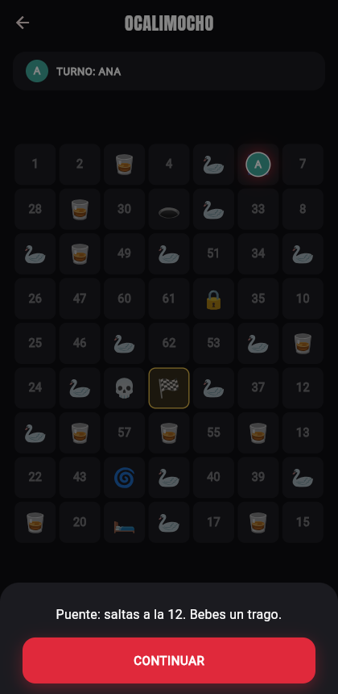

# 🃏 Baraja Party

Una app de juegos de fiesta hecha con Flutter. Pensada para pasar el móvil de mano en mano durante una pregame: sin cuentas, sin configuración, sin explicaciones — se toca y se juega.

**🔗 Pruébala en vivo:** [drinkygames.jvvdix.es](https://drinkygames.jvvdix.es)
📲 APK para Android: [drinkygames.jvvdix.es/drinky-games.apk](https://drinkygames.jvvdix.es/drinky-games.apk)

<p align="center">
  
  
  
</p>

## Modos de juego

### Rojo o Negro
Un mazo de 52 cartas, barajado. Tocas la carta y pasa a la siguiente — así de simple. Cuando se agota el mazo, un botón lo vuelve a barajar.

### Ocalimocho
Una versión bebedora del clásico **Juego de la Oca**: tablero espiral de 63 casillas, de 2 a 8 jugadores con su ficha y color, dado animado. Las casillas especiales (ocas 🦢, puente 🌉, posada 🛏️, pozo 🕳️, laberinto 🌀, cárcel 🔒, calavera 💀, meta 🏁) reparten tragos en vez de las reglas clásicas.

### Modo 3
Próximamente.

## Stack

- **[Flutter](https://flutter.dev)** / Dart — una sola base de código para móvil y web, sin gestor de estado externo
- **[Cloudflare Workers](https://developers.cloudflare.com/workers/)** (Workers Assets) — sirve el build web y el APK como assets estáticos en un dominio propio
- Fuente [Anton](https://github.com/google/fonts/tree/main/ofl/anton) (OFL) empaquetada localmente

El sistema de diseño (paleta, tipografía, componentes, reglas de marca) está documentado en [`DESIGN.md`](DESIGN.md); el contexto de producto (usuarios, personalidad, principios) en [`PRODUCT.md`](PRODUCT.md).

## Correr el proyecto en local

```bash
flutter pub get
flutter run -d chrome        # o -d macos / un dispositivo conectado
```

## Build y despliegue

```bash
# Web
flutter build web --release
npx wrangler deploy

# Android (requiere Android SDK + JDK configurados)
flutter build apk --release --split-per-abi
cp build/app/outputs/flutter-apk/app-arm64-v8a-release.apk build/web/drinky-games.apk
npx wrangler deploy
```

El despliegue usa el dominio y las rutas configuradas en [`wrangler.jsonc`](wrangler.jsonc); requiere estar autenticado con `npx wrangler login` contra la cuenta de Cloudflare correspondiente.

## Estructura

```
lib/
  models/     # Deck de cartas, tablero de la Oca, jugadores
  screens/    # Home, Rojo o Negro, Ocalimocho (setup + juego)
  widgets/    # Componentes reutilizables (carta, dado, tablero, botones, tap feedback)
  main.dart   # Tema, tokens de color/tipografía
```
